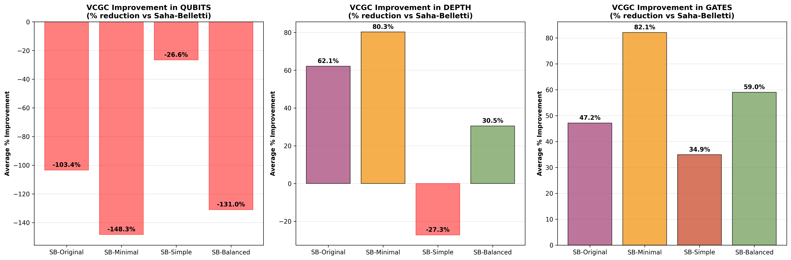
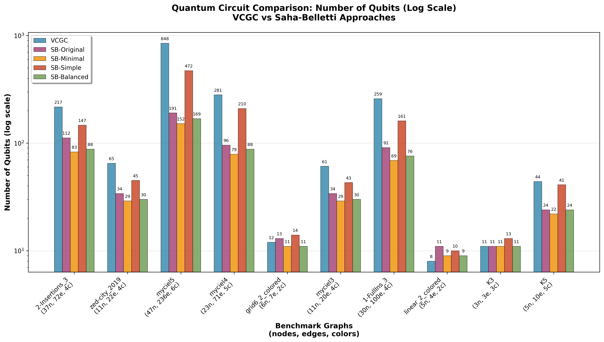
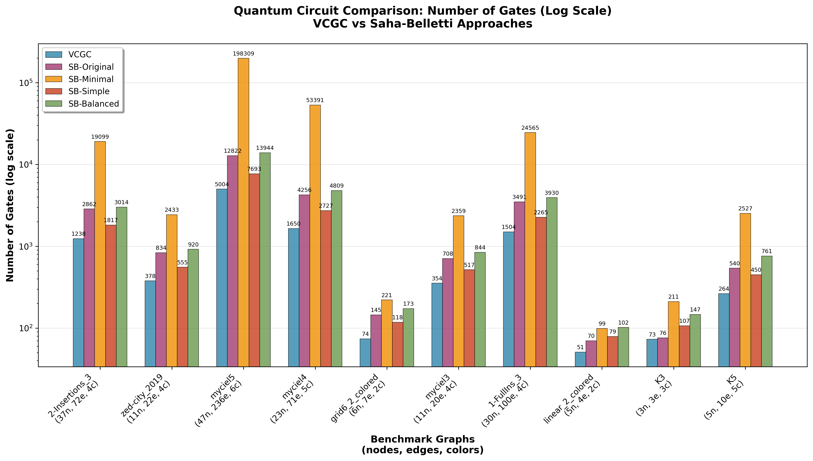
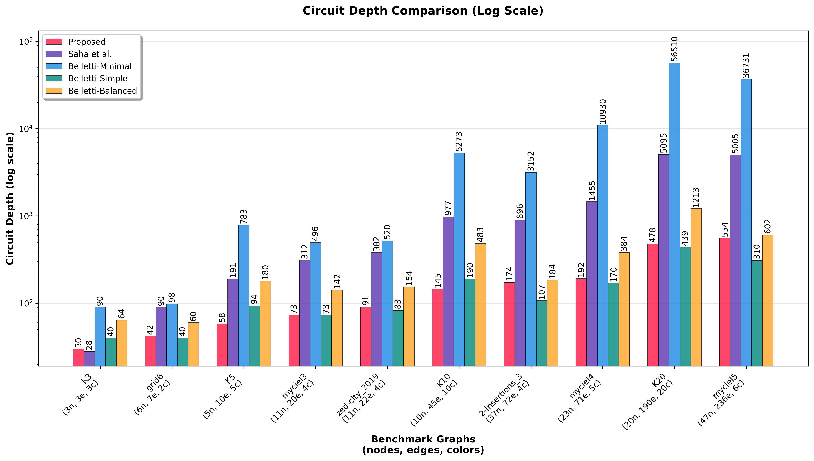

# VCGC: High-Level Synthesis and Benchmarking for Quantum Vertex Coloring

[](https://choosealicense.com/licenses/mit/)
[](https://www.python.org/downloads/)
[](https://qiskit.org/)

## Overview

**VCGC** is a research-driven Python library and experimental suite for compiling vertex coloring problems into quantum circuits, leveraging Grover's algorithm. It provides:

- An automated high-level synthesis (HLS) flow from graph instances to quantum circuits
- Extensive benchmarking and comparison to state-of-the-art (Saha-Belletti) methods
- Tools for reproducible experiments and quantum hardware execution


## Key Contributions

- **Automated Quantum Circuit Generation**: End-to-end pipeline from DIMACS graph files to Grover oracles and full quantum circuits.
- **Benchmark Suite**: Includes real-world and synthetic graphs, with results on circuit size, depth, and quantum resource counts.
- **State-of-the-Art Comparison**: Direct, scriptable comparison to the Saha-Belletti approach.
- **Experimental Results**: Extensive data on circuit synthesis, hardware runs, and quantum/classical performance.
- **Reproducibility**: All experiments, data, and scripts are included for full reproducibility.


## Installation
 > **Note**: Because the `tweedledum` library has not been updated for python versions >3.10, I recommend to use python 3.10 for this project. 

### Using uv (Recommended)

```bash
git clone --recursive https://github.com/TheBarzani/vcgc.git
cd vcgc
uv venv --python 3.10
uv sync
uv pip install -e .
```

### Using pip

```bash
git clone --recursive https://github.com/TheBarzani/vcgc.git
cd vcgc
python -m venv .venv
source .venv/bin/activate
pip install -r requirements.txt 
pip install -e .
```


## Quick Start

### 1. Generate a Quantum Circuit from a Graph

```python
import vcgc
network = vcgc.VCPNetwork()
network.read_dimacs("data/benchmarks/myciel3.col")
bf = vcgc.BooleanFunction()
expr, vars = bf.generate_coloring_expression(network)
synth = vcgc.Synthesizer()
qc = synth.synthesize_with_xag(expr, vars)
qc.draw()
```

### 2. Run Benchmarks

```bash
python examples/run_benchmarks.py --output results.csv
```

### 3. Compare to Saha-Belletti

Check out `examples/comparing_vcgc_to_saha_belletti.ipynb`.


## Library Components

- **`VCPNetwork`**: Graph parsing and management (DIMACS support)
- **`BooleanFunction`**: Boolean constraint generation for coloring
- **`Synthesizer`**: Logic network synthesis to quantum circuits (XAG, etc.)
- **Benchmark Scripts**: Automated evaluation and comparison
- **Visualization**: Circuit and result plotting utilities


## Experimental Results

### Performance Improvements over Saha-Belletti

Our approach demonstrates significant improvements across all key quantum circuit metrics:



- **Circuit Depth**: 62.1% average reduction (up to 80.3% in SB-Minimal variant)
- **Gate Count**: 47.2% average reduction (up to 82.1% in SB-Minimal variant)  
- **Qubit Usage**: More efficient in most cases, with strategic trade-offs

### Detailed Circuit Comparisons

#### Qubit Count Comparison


#### Gate Count Comparison


#### Circuit Depth Comparison


### Data and Resources

The repository includes:

- **Raw and processed benchmark data** (see `data/` and `output/`)
- **Comparison plots**: VCGC vs. Saha-Belletti (see `examples/` and `output/`)
- **Quantum resource counts**: Qubits, gates, depth, etc.
- **Hardware execution scripts**: For IBM Quantum and simulators


## Reproducibility

All experiments can be reproduced using the provided scripts and data. To reproduce the main results:

1. Install dependencies and the package (see above)
2. Run `examples/run_benchmarks.py` and `examples/comparing_vcgc_to_saha_belletti.py`
3. See `output/` for results and plots

## Citing

If you use this code or data, please cite the paper draft or this repository.

## License

TODO